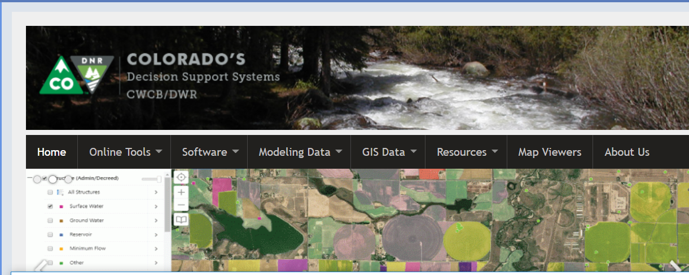

# OpenCDSS / Introduction #

This is the documentation for the OpenCDSS project,
which is the open source software implementation of
[Colorado's Decision Support Systems (CDSS)](http://cdss.state.co.us).
The OpenCDSS effort seeks to change the paradigm of how CDSS software is developed, maintained, and supported,
in order to encourage a larger software developer and user community to engage
in transparent and sustainable software projects.

This introduction page includes the following sections:

* [How to Use this Documentation](#how-to-use-this-documentation) - guidance and list of main documentation sections
* [Colorado's Decision Support Systems](#colorados-decision-support-systems) - the system under which the software is maintained
* [Project Leadership](#project-leadership) - leadership for the OpenCDSS project
* [OpenCDSS Background](#opencdss-background) - history of OpenCDSS
* [OpenCDSS Status](#opencdss-status) - OpenCDSS status, updated at major milestones
* [How to Get Involved](#how-to-get-involved) - how to get involved with OpenCDSS
* [License](#license) - license for this documentation
* [Source Repository on GitHub](#source-repository-on-github) - location of OpenCDSS documentation repository in GitHub
* [Release Notes](#release-notes) - release notes for OpenCDSS documentation

------------

## How to Use this Documentation ##

This website provides overview information about the OpenCDSS project.
Separate pages are provided discussing important overarching concepts such as software licensing.
Each major CDSS software component is also described in a separate page.

Use the left navigation menu to access pages in this documentation.
Use the right navigation menu to access sections within a page.
If the website is viewed in a narrow window or on a mobile device,
the navigation features may be shown as icons with associated popup menus.

## Colorado's Decision Support Systems ##

Colorado's Decision Support Systems (CDSS, [www.colorado.gov/cdss](http://www.colorado.gov/cdss))
has been developed to answer important questions about Colorado's water resources.
CDSS efforts are led by the [Colorado Water Conservation Board (CWCB)](http://cwcb.state.co.us)
and [Colorado Division of Water Resources (DWR)](http://water.state.co.us).

CDSS has been under development since 1994, with progress occurring via a series of basin
decision support systems (DSS), starting with the Colorado River DSS (CRDSS).
Other focused DSS were also developed, such as the CWCB's Instream Flow DSS.
Each DSS resulted in enhancements to the core CDSS tools,
which are envisioned as a general platform of data and tools to help with water supply planning.

In late 2016, a contract was awarded to move StateMod and other CDSS software to open source licensing
and establish open source software projects, referred to as "OpenCDSS".
The OpenCDSS project is a significant evolution in how CDSS software development occurs,
such as implementing version control with Git/GitHub and modernizing the development environment and documentation. 

## Project Leadership ##

OpenCDSS leadership is comprised of State of Colorado agency staff and consultants.
Each software project also has a State of Colorado contact, as indicated on the individual product pages,
and is supported by software developers that have experience with each tool.
Leadership roles are expected to change as the OpenCDSS effort matures and more people become involved
and demonstrate an ability to contribute to software.

* The OpenCDSS CWCB contact is [Brian Macpherson](mailto:brian.macpherson@state.co.us).
* The OpenCDSS DWR lead is [Kelley Thompson](mailto:kelley.thompson@state.co.us).

The OpenCDSS consulting team effort is led by the
[Open Water Foundation](http://openwaterfoundation.org/).
[Wilson Water Group](http://www.wilsonwatergroup.com/) is a key subcontractor given their
experience with CDSS modeling projects.
[Open Tech Strategies](https://opentechstrategies.com/) provided expert advice on implementation of open source approach.

Each CDSS software tool is being implemented as a separate open source project with one or more GitHub repositories
(see the main navigation links on this website to access products).
Software developers and State of Colorado staff with appropriate capabilities and interests are
associated with each software tool's project.
The initial OpenCDSS effort has established basic protocols that will be followed on other projects.
These protocols will evolve over time in response to experience and feedback.

## OpenCDSS Background ##

The OpenCDSS project grew out of a recognition that the traditional approach to developing and maintaining
CDSS software tools was not sustainable.
Motivation for change was provided by loss of technical staff at State
agencies and consulting companies.  Key concerns included:

1. How will knowledge about CDSS tools be retained?
2. How will a new generation of CDSS users and developers be established?
3. How can software be maintained using current professional standards?
4. How can the cost and human effort of software maintenance be distributed?

Consequently, the concept of "open source CDSS" was identified as an option,
with goals similar to many other open source software projects.
Although the State of Colorado through its various agencies and programs
does create and maintain software,
software development is not its primary function,
and providing software support to the public and consultants is not a primary role.
Consequently, a project was put out to bid, which the Open Water Foundation won.
The OpenCDSS project began in October of 2016.
Since that time, major tasks have been to manage software in GitHub repositories,
create developer documentation, coordinate open source license implementation,
and establish governance and culture for open source software projects.
It is expected that additional projects will comply with OpenCDSS protocols as
software tools are updated, and that OpenCDSS protocols will learn and adapt from project experience.

## OpenCDSS Status ##

The OpenCDSS project initially focused on fundamental technical and educational issues in order to
implement high-quality open source projects.
Of particular importance is firming up the sustainability of key modeling tools including
StateCU and StateMod.

Significant progress has been made in many areas, including the following (see individual software pages for more information):

* Determining software licenses [(see OpenCDSS Licensing)](../licensing/licensing):
	+ [General Public License (GPL 3.0)](https://www.gnu.org/licenses/gpl-3.0.en.html)
	has been implemented for the main CDSS software tools.
	+ [Creative Commons Attribution 4.0 International (CC BY 4.0)](https://creativecommons.org/licenses/by/4.0/)
	has been implemented for documentation.
* Placing software under version control [(see OpenCDSS Version Control)](../version-control/version-control):
	+ The State has established the [OpenCDSS GitHub account](https://github.com/OpenCDSS) to house repositories.
	+ Public repositories have been created for key CDSS tools.
	+ Software, documentation, and tests are typically saved in different repositories to facilitate
	work using different development environments and skills.
* Implementing new/updated development environments [(see OpenCDSS Development Environment)](../dev-env/dev-env):
	+ Developer documentation has been created for each tool.
	+ Development environments are integrated with version control.
	+ Standard workflows have been implemented to report issues and follow up with the development team.
* Implementing tools for documentation [(see OpenCDSS Documentation)](../documentation/documentation):
	+ Documentation has been moved to online format,
	with complete migration occurring over time.
	+ Documentation versions are maintained in GitHub repositories.
* Implementing tools for testing [(see OpenCDSS Testing)](../testing/testing):
	+ Automated testing frameworks are being implemented at various levels for different software.
	+ This is an ongoing activity given the complexity of software functionality.

The OpenCDSS website and GitHub repositories are also being integrated with core CDSS program and website.
This involves activities such as the following:

1. Linking the CDSS website to software project GitHub repositories and documentation such as this documentation.
2. Establishing a workflow whereby software enhancements and issues are identified and implemented and
product releases are made available on the CDSS website.
3. Establishing a backlog of software work tasks, such as via the GitHub issues page.
4. Prioritizing OpenCDSS/CDSS software enhancements across projects using various funding sources,
contract vehicles, and human resources.

## How to Get Involved ##

The technical nature of OpenCDSS has required a period of time to determine
approach and overcome technical issues.
Most issues with OpenCDSS initialization have been resolved, resulting in protocols and working examples for
version control, development environment, documentation, testing, etc., as discussed in other sections of this documentation.
The following sections indicate how to get involved with OpenCDSS as it is used to maintain and enhance CDSS tools.

### OpenCDSS Leadership ###

The OpenCDSS leadership (see [Project Leadership](#project-leadership)) is lean by design, with the initial focus
on ensuring that core CDSS software products are effectively moved to open source projects.
State personnel have also been evaluating how to allocate internal resources to each software tool.
As open source software projects engage more people, there will be opportunities to further evaluate how best
to allocate human resources aligned with each software tool.
OpenCDSS leadership coordinates with other State projects and programs.

### Software Development Team ###

The OpenCDSS project is attempting to implement open source software projects for each major CDSS software component.
These tools are complicated and use various technologies.
Some OpenCDSS budget is being used to train key personnel how to work in the new development environments.
However, the reality is that OpenCDSS budget cannot train everyone that is interested in contributing to software.
Like many other open source projects, the burden of learning software development tools will fall on individuals
or other projects, with the expectation that software developers have a reasonable skill level
to be able to contribute.

A compromise is to use some OpenCDSS resources on development environment documentation so that new developers
have context and can learn from documentation prepared by previous developers.
Efforts have been made to help increase OpenCDSS knowledge, such as developing the
[CDSS / Learn Git](http://opencdss.state.co.us/cdss-learn-git/) training materials
and developer manuals for each software tool.
Enhancement of documentation, training opportunities, and other educational efforts will continue in the future.

If you are interested in contributing to a software project, engage with the project by using the software,
making suggestions via the GitHub issues page for the project, contributing code via the open source project,
or providing funding for specific enhancements.

### CDSS User Group ###

OpenCDSS leaders are also interested in forming a "CDSS User Group",
which will meet periodically to discuss advances in CDSS tools, provide opportunities to give feedback,
provide training, etc.
The logistics of this effort are being coordinated with State of Colorado staff.
This group will lean on CDSS practitioners to present information and provide feedback.
More information will be provided in the future.

## License ##

The license for this documentation is the
[Creative Commons CC-BY 4.0 license](https://github.com/OpenCDSS/cdss-website-opencdss/blob/master/LICENSE.md).

## Source Repository on GitHub ##

The source files for this documentation are maintained in the public GitHub repository:
[cdss-website-opencdss](https://github.com/OpenCDSS/cdss-website-opencdss).

## Release Notes ##

See the [GitHib repository for this documentation](https://github.com/OpenCDSS/cdss-website-opencdss)
for release notes for this documentation.
Release notes for each software application are provided with the software.
